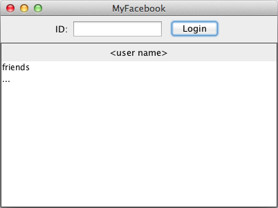
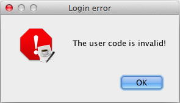

OOP Lab 6 - Social Network
==============

(the Italian version is available in file [README_it.md](README_it.md)).


Develop an application to support a social network. All classes must be
in the package `social`.

------------------------------------------------------------------------

R1 - Subscription
-----------------

The interaction with the system is made using class `Social`.

You can register new account using method `addPerson()` which receives
as parameters a unique code, name and surname.

The method throws the exception `PersonExistsException` if the code
passed is already associated to a subscription.

The method `getPerson()` returns a string containing code, name and
surname of the person, in order, separated by blanks. If the code,
passed as a parameter, does not match any person, the method throws the
exception `NoSuchCodeException`.


R2 - Friends
------------

Any person, registered in the social, should have possibility to add
friends. Friendship is bidirectional: if person A is friend of a person
B, that means that person B is a friend of a person A. 

Friendship is created using method `addFriendship()` that receives as arguments the
codes of both persons. The method throws the exception `NoSuchCodeException`
if one or both codes do not exist.

Method `listOfFriends()` receives as argument the code of a person and
returns the collection of his/her friends. The exception
`NoSuchCodeException` is thrown if the code does not exist. If a
person has no friends, an empty collection is returned.

The method `friendsOfFriends` receives as a parameter the code of a
person and returns the collection of the code of the friends of his/her friends,
i.e. friends of the second level. The exception `NoSuchCodeException`
is thrown if the code does not exist. If the list is empty, the method
returns an empty collection. The list should not contain the person whose
code was passed as parameter. (i.e. *"remove yourself from the
list"*)

The method `friendsOfFriendsNoRepitition()` returns the list of codes
of friends of the second level (friends of the friends), like the
previous method, with the difference that it should delete duplicated persons.
If the list is empty, the method should return an empty collection. 
The exception `NoSuchCodeException` is thrown if the
code does not exist.


R3 - Groups
-----------

It is possible to register a new group using method `addGroup()`. Name
of the group should be a single word.

The method `listOfGroups()` returns the list of names of all
registered groups. If there are no groups in the list, the method should
return an empty collection.

A person can subscribe to a group through the method `addPersonToGroup()`
that receives as arguments the code of the person and the name of the
group. In case the code of the person, or the name of the group are
not found a `NoSuchCodeException` is thrown.

Method `listOfPeopleInGroup()` returns collection of codes of people
subscribed to a given group. Returns null if the group does not exist.


R4 - Statistics
---------------

Method `personWithLargestNumberOfFriends()` returns code of a person
that has the largest amount of friends (first level). Do not consider the
case of ties.

Method `personWithMostFriendsOfFriends()` returns code of a person
that has the largest amount of the friends of friends (second level). Do not
consider the case of ties.

Method `largestGroup()` returns name of the group with the largest number
of members. Do not consider the case of ties.

Method `personInLargestNumberOfGroups()` returns code of a person that
is subscribed to the largest number of groups. Do not consider the case of
ties.


R5 - GUI Layout
---------------

Develop the GUI for the social network application. The
class `SocialGui` that represent the interface provides a constructor
accepting a *Social* object as an argument.

Use the graphical components provided as attributes of the class.

The layout of the application must be similar to the one reported below.

 

- Hint: you should consider nesting components by using `JPanel` as
    container, e.g. if you wish to have several components in the
    `NORTH` area of a border layout:
    
```
setLayout(new BorderLayout());
JPanel upper = new JPanel();
upper.setLayout(new FlowLayout());
upper.add( ... );

add(upper,BorderLayout.NORTH);
```


R6 - Login
----------

To login, a user must enter its unique code in the ID
field and click the `Login` button.

When the user attempts to log in, the system must check if the code is
valid, then it must show the first and last name of the user in the
corresponding area (indicated as `< user name >` in the mock-up
above).

If the code is invalid an error message box must be presented to the
user:



After a successful login, the system must show the list of friends in the
corresponding list component.

- Hint: use the `setListData(Object[])` method of class `JList` to populate
    the list content.

It must be also possible to login just hitting *enter* after writing the
code.

- Hint: use the `KeyListener` and in particular the `keyReleased()` method.
    Then compare the key code to the constant value `KeyEvent.VK_ENTER`.
