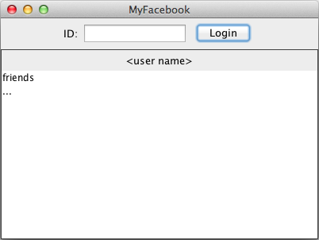

Social Network
==============

Sviluppare un'applicazione per supportare un social network. Tutte le
classi si devono trovare nel package `social`.


R1 - Sottoscrizione
-------------------

L'interazione con il sistema avviene tramite la classe `Social`.

È possibile registrare un nuovo account tramite il metodo
`addPerson()` che accetta come parametri un codice univoco, nome e
cognome.

Il metodo lancia un'eccezione di `PersonExistsException` se il codice
univoco è già associato a un account.

Il metodo `getPerson()` restituisce una stringa contenente codice, nome
e cognome della persona, separati da spazi. Se il codice passato come
parametro non corrisponde a nessun account, il metodo lancia
un'eccezione di `NoSuchCodeException`.


R2 - Amicizia
-------------

Una persona, registrata sul social network, può aggiungere degli amici.
L'amicizia è bi-direzionale: se la persona Tizio è amico della persona
Caio, questo significa che la persona Caio è amico di Tizio.

L'amicizia viene stabilita con il metodo `addFriendship()` che
accetta come parametri il codice di entrambe le persone. Il metodo
lancia un'eccezione di `NoSuchCodeException` se almeno uno dei due
codici non esiste.

Il metodo `listOfFriends()` riceve come parametro il codice di una
persona e restituisce la collezione dei suoi amici. Viene lanciata una
`NoSuchCodeException` se il codice non esiste.

Se la persona non ha amici viene restituita una collezione vuota.

Il metodo `friendsOfFriends` riceve come parametro il codice di una
persona e restituisce la collezione degli amici dei propri amici, ovvero
gli amici di secondo livello. Viene lanciata una `NoSuchCodeException`
se il codice non esiste.

Se la persona non ha amici di amici viene restituita una collezione
vuota.
La collezione non deve contenere la persona il cui codice è stato
passato al metodo. ("rimuovi te stesso dall lista")

Il metodo `friendsOfFriendsNoRepitition()` restituisce la lista dei
codici degli amici di secondo livello, come il metodo precedente, ma
senza duplicati. Viene lanciata una `NoSuchCodeException` se il codice non esiste.


R3 - Gruppi
-----------

È possibile registrare un gruppo tramite il metodo `addGroup()`. Il
nome del gruppo deve consistere in una sola parola.

Il metodo `listOfGroups()` restituisce la lista dei nomi di tutti i
gruppi registrati o la collezione vuota se non ce ne sono.

Una persona può essere iscritta a un gruppo tramite il metodo
`addPersonToGroup()` che riceve come parametri il codice della persona
e il nome del gruppo. Viene lanciata una `NoSuchCodeException` se il 
codice della persona o il nome del gruppo non esiste.

Quindi il metodo `listOfPeopleInGroup()` restituisce la collezione dei
codici delle persone iscritte al gruppo dato. Restituisce `null` se il
nome del gruppo non esiste.


R4 - Statistiche
----------------

Il metodo `personWithLargestNumberOfFriends()` restituisce il codice
della persona che ha il maggior numero di amici (di primo livello). Si
supponga che non esistano casi di parità.

Il metodo `personWithMostFriendsOfFriends()` restituisce il codice
della persona con il maggior numero di amici di amici (secondo livello).
Si supponga che non esistano casi di parità.

Il metodo `largestGroup()` restituisce il nome del gruppo con il
maggior numero di membri. Si supponga che non esistano casi di parità.


R5 - GUI Layout
---------------

Sviluppare un'interfaccia grafica per l'applicazione.
La classe `SocialGui`, che rappresenta l'interfaccia, fornisce un
costruttore che accetta un oggetto `Social` come parametro.

Si utilizzino i componenti forniti come attributi della classe (al fine
di rendere l'interfaccia testabile).

Il layout deve essere simili a quello mostrato qui sotto.



- Suggerimento: per annidate componenti si usi `JPanel` come contenitore, ad esempio
    per inserire diversi componenti nell'area `NORTH` di un border layout:

```
setLayout(new BorderLayout());

JPanel upper = new JPanel();
upper.setLayout(new FlowLayout());
upper.add( ... );

add(upper,BorderLayout.NORTH);
```


R6 - Login
----------

Per effettuare il login, un utente deve inserire il
proprio codice univoco nel campo ID e premere il pulsante *Login*.

Quando un utente esegue il login, il sistema controlla che il codice sia
valido, quindi deve mostrare nome e cognome nell'area corrispondente
(indicata come `< user name >` nell'immagine precedente).

Se il codice non è valido deve essere mostrato il messaggio di errore qui sotto.


Dopo un login riuscito, il sistema deve mostrare la lista degli amici
nella lista corrispondente.

- Suggerimento: si usi `setListData(Object[])` della classe `JList` per inserire
    dei contenuti nella lista.

Inoltre deve essere possibile fare il login semplicemente premendo il
tasto enter sulla tastiera dopo ave scritto il codice.

- Suggerimento: si usi un `KeyListener` e in particolare il metodo `keyReleased()`. 
  Si confronti il codice del tasto con la costante `KeyEvent.VK_ENTER`.